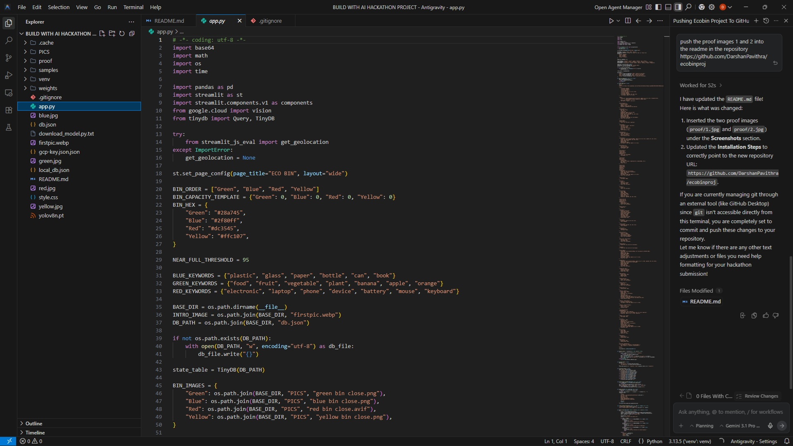
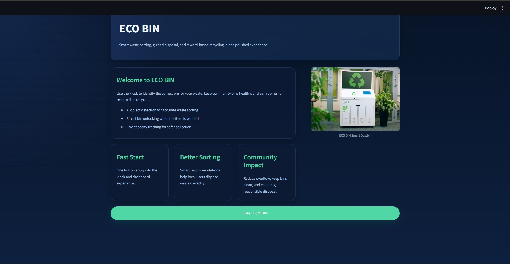
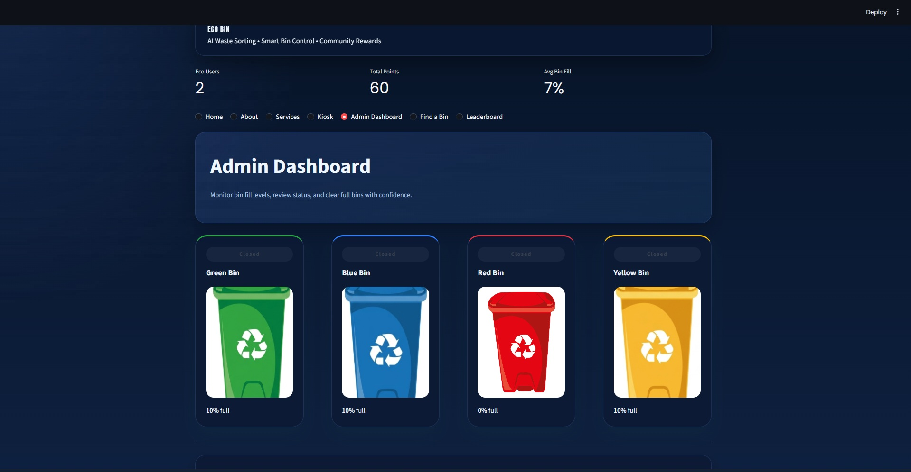

# ECO BIN

## Problem Statement
Waste mismanagement is a global crisis, often stemming from a simple lack of knowledge at the point of disposal. Most people want to recycle or compost but are frequently confused by which item goes into which bin, leading to contaminated recycling streams and overflowing landfills. Furthermore, there is often no immediate incentive or feedback for individuals to practice proper waste segregation.

## Project Description
ECO BIN is a polished, interactive kiosk-style application designed to revolutionize community waste sorting. By combining computer vision with a gamified user experience, it removes the guesswork from disposal.

### How it Works:
Users simply capture or upload a photo of their waste item at the kiosk. The system instantly analyzes the object and identifies the correct bin:

🟢 **Green:** Composting
🔵 **Blue:** Recycling
🔴 **Red:** E-Waste
🟡 **Yellow:** Landfill

### Why it’s Useful:
Beyond simple classification, ECO BIN features a point-based reward system and an interactive leaderboard to incentivize sustainable habits. For administrators, it provides a live dashboard to monitor bin capacities and receive alerts when a bin is near full, optimizing the waste collection process.

## Google AI Usage

### Tools / Models Used
- Google Cloud Vision API

### How Google AI Was Used
The core intelligence of ECO BIN is powered by the Google Cloud Vision API. When a user submits an image, the application sends the data to Google’s vision models, which return highly accurate descriptive labels for the object. We then use a custom routing algorithm to map these labels against categorized keyword sets to determine the specific waste bin required. This allows for robust detection of everything from organic food waste to complex electronics without needing a locally trained model.

## Proof of Google AI Usage


### Screenshots



### Demo Video
Upload your demo video to Google Drive and paste the shareable link here (max 3 minutes). [Watch Demo](https://drive.google.com/file/d/1W9i-3Is1dyFax5Xf9kOIbd0MW3TBpxZn/view?usp=sharing)

## Installation Steps

```bash
# Clone the repository
git clone https://github.com/DarshanPavithra/ecobinproj.git

# Go to project folder
cd ecobinproj

# Install dependencies
pip install streamlit pandas tinydb google-cloud-vision streamlit-js-eval

# Run the project
streamlit run app.py
```
